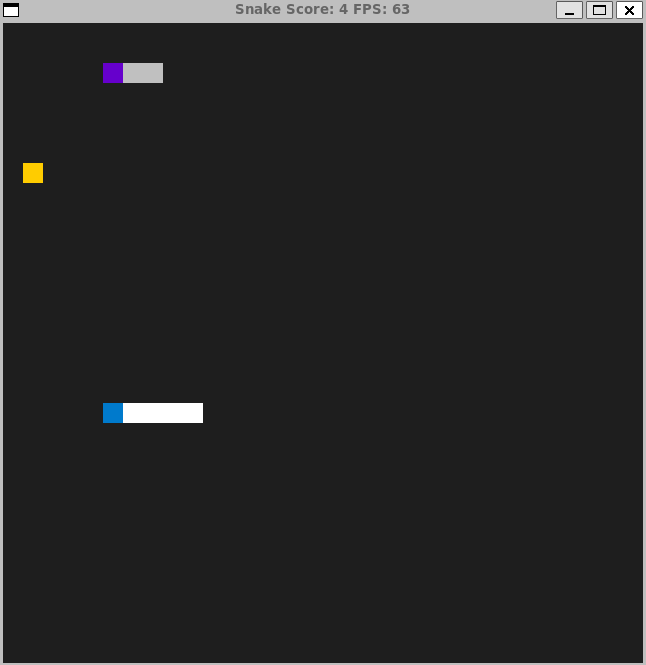

# Snake Game: Fight the Hungry Robot Snake
###### On top of the classic game play, player can now play against a fierce robot snake that can smell the food from miles away. This robot snake is much stronger than yours, so be careful do not clash into its body otherwise you will die.

### Solo Mode:

### Play against a robot snake:

## Dependencies for Running Locally
* cmake >= 3.7
  * All OSes: [click here for installation instructions](https://cmake.org/install/)
* make >= 4.1 (Linux, Mac), 3.81 (Windows)
  * Linux: make is installed by default on most Linux distros
  * Mac: [install Xcode command line tools to get make](https://developer.apple.com/xcode/features/)
  * Windows: [Click here for installation instructions](http://gnuwin32.sourceforge.net/packages/make.htm)
* SDL2 >= 2.0
  * All installation instructions can be found [here](https://wiki.libsdl.org/Installation)
  >Note that for Linux, an `apt` or `apt-get` installation is preferred to building from source. 
* gcc/g++ >= 5.4
  * Linux: gcc / g++ is installed by default on most Linux distros
  * Mac: same deal as make - [install Xcode command line tools](https://developer.apple.com/xcode/features/)
  * Windows: recommend using [MinGW](http://www.mingw.org/)

## Basic Build Instructions

1. Clone this repo.
2. Make a build directory in the top level directory: `mkdir build && cd build`
3. Compile: `cmake .. && make`
4. Run it: `./SnakeGame`.
5. After the prompt is displayed, enter "Y" or "y" to play against a robot, or enter "N" or "n" to play in solo mode.

## Rubrics Completed
| Rubric | file | line# |
|----------|----------|----------|
|  The project accepts user input and processes the input.  |  main.cpp   | 15 |
|  Class constructors utilize member initialization lists  |   snake.h  |   65  |
| Overloaded functions allow the same function to operate on different parameters.| renderer.h | 15 |
| Classes follow an appropriate inheritance hierarchy.| snake.h | 62 |
|Classes use appropriate access specifiers for class members.| snake.h| 62|
|The project makes use of references in function declarations.|renderer.h|30|
|The project uses smart pointers instead of raw pointers.|game.h|22|
|The project uses multithreading.|game.cpp|20|

## CC Attribution-ShareAlike 4.0 International

Shield: [![CC BY-SA 4.0][cc-by-sa-shield]][cc-by-sa]

This work is licensed under a
[Creative Commons Attribution-ShareAlike 4.0 International License][cc-by-sa].

[![CC BY-SA 4.0][cc-by-sa-image]][cc-by-sa]

[cc-by-sa]: http://creativecommons.org/licenses/by-sa/4.0/
[cc-by-sa-image]: https://licensebuttons.net/l/by-sa/4.0/88x31.png
[cc-by-sa-shield]: https://img.shields.io/badge/License-CC%20BY--SA%204.0-lightgrey.svg
